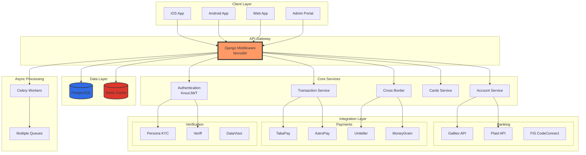

# CLAUDE.md

This file provides guidance to Claude Code (claude.ai/code) when working with code in this repository.

## Project Purpose

This repository is specifically designed for the MyBambu middleware architect hiring process. It serves as:
- A hub for analyzing the current middleware architecture
- A framework for creating job descriptions and interview questions
- A platform for developing technical challenges for candidates
- A reference point for evaluating potential middleware architects

## Key Reference Repositories

### Primary Middleware Monolith
- **Path**: `/Users/patrickwatson/git/bambu-workspace/submodules/bambu-middleware`
- **Description**: Django-based monolithic middleware serving as the core backend for MyBambu's financial services platform
- **Critical Focus Area**: This is what the hired architect will primarily work on

### Documentation Sources
- **Atlassian Wiki**: `/Users/patrickwatson/git/bambu-workspace/docs/atlassian-wiki/`
  - Contains 851 pages of comprehensive middleware documentation
  - Includes process flows, database schemas, partner integrations
- **Parent Workspace**: `/Users/patrickwatson/git/bambu-workspace/`
  - Contains additional submodules and project documentation

## Current Middleware Technology Stack

### Core Technologies
- **Framework**: Django 4.2.9 with Django REST Framework 3.14.0
- **Language**: Python 3.x
- **Database**: PostgreSQL (via psycopg2)
- **Caching/Queue**: Redis 4.5.5, Celery 5.2.7
- **Authentication**: Knox tokens, JWT
- **API Documentation**: drf-spectacular (OpenAPI/Swagger)

### Key Integrations (Partner Services)
- **Payment Processing**: Galileo, TabaPay, AstroPay, Uniteller
- **Identity Verification**: Persona, Veriff, DataVisor
- **Banking**: Plaid, FIS CodeConnect
- **Communications**: Twilio (SMS/Voice)
- **International Money Transfer**: MoneyGram, TransNetwork
- **Mobile Top-ups**: Ding
- **Analytics**: AppFlyer, Pinpoint
- **CRM**: Salesforce
- **Tax Compliance**: Avalara
- **Fraud/AML**: Unit21, TransUnion

### Infrastructure & DevOps
- **Containerization**: Docker & Docker Compose
- **Version Control**: Git with semantic versioning (VERSION.txt)
- **Testing**: pytest with coverage reporting
- **Code Quality**: Black, Flake8, pre-commit hooks
- **AWS Services**: S3, SES, SNS, Secrets Manager
- **Monitoring**: New Relic

## Architecture Overview

### Application Structure
The middleware follows a modular Django app structure with ~50+ apps including:
- **account**: User management, authentication, KYC
- **adminportal**: Administrative interfaces
- **cross_border**: International money transfers
- **galileo**: Core banking integration
- **transactions**: Transaction processing
- **cards**: Card management
- **benefits**: Rewards and benefits system

### Database Architecture
- **ORM**: Django Models with PostgreSQL
- **Key Models**: 200+ database tables documented in `bambu_models`
- **Migrations**: Managed through Django migrations system

### Queue Architecture
Multiple Celery queues for asynchronous processing:
- galileo_queue, veriff_queue, salesforce_queue
- appsflyer_queue, unit21_queue, crossborder_queue
- statements_queue, kard_queue, bulk_mail_queue

## Development Commands

### Environment Setup
```bash
make init                 # Initialize project with pre-commit hooks
make up-build            # Build and start Docker environment
make migrate             # Run database migrations
make create-superuser    # Create Django admin user
```

### Development Workflow
```bash
make test                # Run all tests
make test-one TEST_TARGET=<test_class>  # Run specific test
make lint                # Run Black and Flake8
make logs                # View service logs
```

### Version Management
```bash
make get-version         # Display current version
make bump-patch          # Increment patch version (bug fixes)
make bump-minor          # Increment minor version (new features)
make bump-major          # Increment major version (breaking changes)
make push-version        # Push version tags to repository
```

## Middleware Architect Hiring Focus Areas

### Technical Expertise Required
1. **Monolith to Microservices Migration**
   - Experience decomposing Django monoliths
   - Service boundary identification
   - API gateway patterns
   - Event-driven architecture

2. **Integration Architecture**
   - Managing 20+ third-party integrations
   - API versioning and backward compatibility
   - Webhook handling and retry mechanisms
   - Partner API abstraction layers

3. **Performance & Scalability**
   - Database optimization (PostgreSQL)
   - Caching strategies (Redis)
   - Queue management (Celery)
   - Load balancing and horizontal scaling

4. **Financial Services Domain**
   - Payment processing workflows
   - Compliance and regulatory requirements
   - Transaction integrity and idempotency
   - PCI DSS compliance

### Code Challenge Ideas

1. **Microservice Extraction Exercise**
   - Identify a bounded context in the monolith
   - Design service boundaries and API contracts
   - Plan migration strategy with zero downtime

2. **Integration Pattern Challenge**
   - Design a resilient integration layer for a payment provider
   - Implement circuit breaker and retry patterns
   - Handle webhook processing with idempotency

3. **Performance Optimization Task**
   - Analyze slow database queries
   - Implement caching strategy
   - Optimize Celery queue processing

### Interview Question Categories

1. **Architecture & Design Patterns**
   - Microservices vs Monolith trade-offs
   - Event sourcing and CQRS
   - API design principles
   - Database sharding strategies

2. **Django & Python Expertise**
   - Django ORM optimization
   - Celery best practices
   - Python async patterns
   - Testing strategies

3. **Financial Services Experience**
   - Payment processing flows
   - Regulatory compliance
   - Fraud prevention
   - Transaction reconciliation

## Documentation Management

### Reference Materials Location
- **docs/references/**: Store PDFs, URLs, and other reference materials here
- Use descriptive filenames for easy discovery
- Maintain an index of key documents

### Key Documentation to Review
1. Process flow diagrams in Atlassian wiki
2. Database ERDs and model documentation
3. Partner API documentation
4. Queue architecture documentation

## Project Structure for Hiring Process

```
bambu-new-hire-mw/
├── CLAUDE.md                    # This file
├── docs/
│   ├── references/             # External reference materials
│   ├── job-description.md      # MW Architect job description
│   ├── interview-questions.md  # Technical interview questions
│   ├── code-challenge.md       # Technical challenge details
│   └── evaluation-rubric.md    # Candidate evaluation criteria
├── analysis/
│   ├── current-architecture.md # Analysis of current system
│   ├── pain-points.md          # Current architectural challenges
│   └── future-vision.md        # Desired architecture goals
└── candidates/
    └── [candidate-name]/       # Individual candidate evaluations
```

## Mermaid Architecture Diagram



## Critical Architectural Challenges

### Current Pain Points
1. **Monolithic Coupling**: All services tightly coupled in single Django project
2. **Database Bottlenecks**: Single PostgreSQL instance handling all operations
3. **Queue Complexity**: Multiple Celery queues with interdependencies
4. **Integration Sprawl**: 20+ third-party integrations without proper abstraction
5. **Testing Challenges**: Difficult to test individual components in isolation
6. **Deployment Risk**: Single deployment affects entire system

### Desired Future State
1. **Microservices Architecture**: Domain-driven service boundaries
2. **API Gateway**: Centralized routing and authentication
3. **Event-Driven Communication**: Kafka/RabbitMQ for service communication
4. **Service Mesh**: Istio/Linkerd for service-to-service communication
5. **Containerization**: Kubernetes orchestration
6. **Observability**: Distributed tracing and monitoring

## Candidate Evaluation Focus

When evaluating candidates, prioritize:
1. **Practical Experience**: Has actually performed monolith decomposition
2. **Financial Domain Knowledge**: Understands payment processing and compliance
3. **Leadership Skills**: Can guide team through architectural transformation
4. **Communication**: Can explain complex concepts to non-technical stakeholders
5. **Problem-Solving**: Approaches challenges methodically with data-driven decisions

## Next Steps for Interview Process

1. **Create Job Description**: Use the technical stack and challenges outlined above
2. **Design Code Challenge**: Focus on practical problems from current architecture
3. **Prepare Interview Questions**: Mix theoretical and practical scenarios
4. **Build Evaluation Rubric**: Create objective scoring criteria
5. **Document Reference Materials**: Gather relevant docs in docs/references/